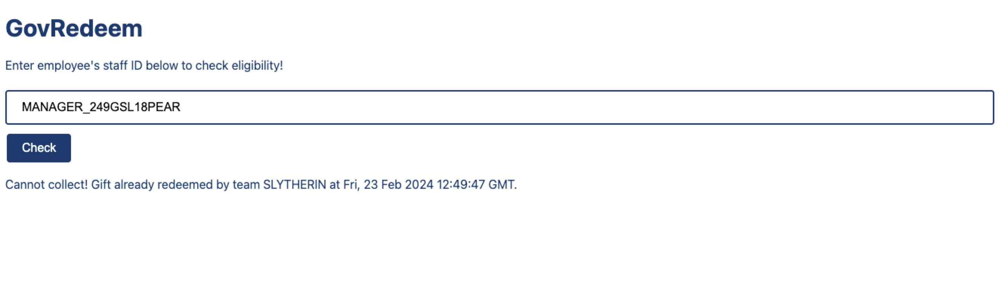
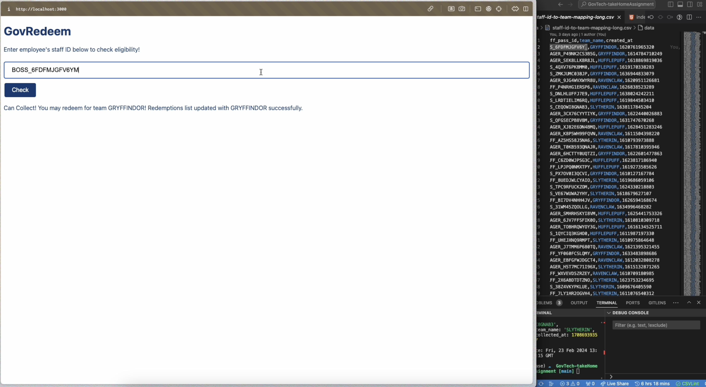

# GovRedeem


It's Christmas, let's check if your staff can collect a gift for your team! This program allows you to check your government-related transactions conveniently.

## Setup

To set up GovWallet, follow the steps below:

1. **Clone** the repository to your local machine.
2. **Navigate** to the project directory via Terminal/Command Prompt.
3. **Install** the dependencies by running the following command:

   ```shell
   $npm install
   $npm run start
   ```
4. **Go** to localhost:3000
5. **Enjoy!**

## Troubleshooting
>Q: Have a new employee or team change? 
Solution: Upload your `.csv` file to /data and name it `staff-id-to-team-mapping-long.csv` and ensure your headers are `staff_pass_id,team_name,created_at`

## Demo video
[](http://www.youtube.com/watch?v=HFxL5VYUCjk?si=Lib6Hdp7FQAoKPin "Demo Video")